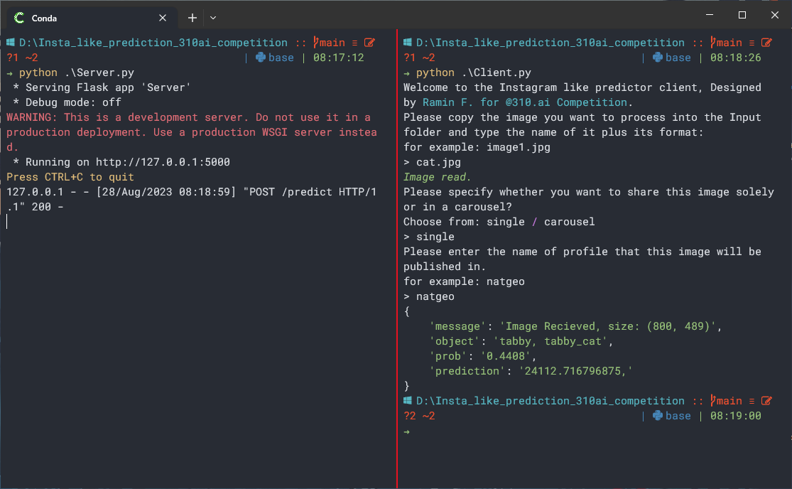

<!-- PROJECT SHIELDS -->


[](https://www.linkedin.com/in/raminferdos/)
[
](mailto:ferdos.ramin@gmail.com)
[](https://Insta_like_prediction_310ai_competition/)

<!-- PROJECT LOGO -->
<br />
<div align="center" id=readme-top>
  <h3 align="center">Instagram's Like Prediction</h3>

  <p align="center">
    My Approach for Predicting the Amount of like for an Instagram Post
    (@310 ai Competition)
    <br />
    <a href="https://github.com/SimplyRamin/Insta_like_prediction_310ai_competition"><strong>Explore the docs »</strong></a>
    <br />
    <br />
    <a href="https://github.com/SimplyRamin/Insta_like_prediction_310ai_competition">View Demo</a>
    ·
    <a href="https://github.com/SimplyRamin/Insta_like_prediction_310ai_competition/issues">Report Bug</a>
    ·
    <a href="https://github.com/SimplyRamin/Insta_like_prediction_310ai_competition/issues">Request Feature</a>
  </p>
</div>


<!-- TABLE OF CONTENTS -->
<details>
  <summary>Table of Contents</summary>
  <ol>
    <li>
      <a href="#about-the-project">About The Project</a>
      <ul>
        <li><a href="#overview">Overview</a></li>
        <li><a href="#methodology">Methodology</a></li>
        <li><a href="#data-collection">Data Collection</a></li>
        <li><a href="#data-preprocessing-and-analysis">Data Preprocessing and Analysis</a></li>
        <li><a href="#modeling">Modeling</a></li>
        <li><a href="#notebooks">Notebooks</a></li>
        <li><a href="#built-with">Built With</a></li>
      </ul>
    </li>
    <li>
      <a href="#project-structure">Project Structure</a>
    </li>
    <li><a href="#usage">Usage</a>
      <ul>
        <li>
          <a href="#consideration">Consideration</a>
        </li>
      </ul>
    </li>
    <li><a href="#contributing">Contributing</a></li>
    <li><a href="#license">License</a></li>
    <li><a href="#contact">Contact</a></li>
    <li><a href="#acknowledgments">Acknowledgments</a></li>
  </ol>
</details>


<!-- ABOUT THE PROJECT -->
## About The Project



### Overview

This project follows the **CRISP-DM** (Cross-Industry Standard Process for Data Mining) methodology to delve into the world of Instagram post-performance evaluation and prediction. Through a reverse engineering approach, I explore the intricate world of performance metrics on Instagram and how they influence the engagement levels of a post.

In addition to the predictive aspect, I've created a robust Instagram Bot Library in Python. This library encompasses a functional Instagram bot with the following capabilities:

- ***Login***: Seamlessly log in to your Instagram account programmatically.
- ***Data Retrieval***: Retrieve data from your Instagram account, such as user details, post information, and more.

This versatile library empowers developers and data enthusiasts to automate Instagram interactions and data retrieval, streamlining various tasks.

### Methodology

- ***Performance Metrics Investigation***: I dive deep into the concept of "performance metrics" on Instagram. I discuss how various parameters contribute to evaluating a post's performance, from likes and comments to other publicly available data.

- ***Feature Engineering***: I employs a unique approach by utilizing EfficientNet B7 for object detection in images. The content of the image, along with publicly available performance metrics like the number of likes and comments, is used as a feature for predicting the number of likes a post will receive.

### Data Collection

***Scraper Development***: I have crafted a scraper leveraging the unofficial Instagram API to gather data. Our scraper focuses on the top 100 pages with the most followers and 100 pages with the most published posts. For each of these pages, I collect their top 9 posts, including the actual images, and save them as records for analysis.

### Data Preprocessing and Analysis

***Data Cleaning***: I've meticulously cleaned the collected dataset, addressing issues like missing values.

***Exploratory Data Analysis (EDA)***: I delve into the dataset, conducting EDA to unearth insights and patterns that guide our modeling efforts.

### Modeling

***Algorithm***: For predicting post likes, I've chosen the powerful XGBoost Regressor as our algorithm of choice.

***Hyperparameter Tuning***: I've employed grid search to identify the best-performing model with optimized hyperparameters.

***Feature Importance***: The trained model provides insights into feature importance, shedding light on what drives post-engagement.

### Notebooks

The details of each step are available in the corresponding Jupyter notebooks within this repository. To gain a comprehensive understanding, it's advisable to follow the notebooks sequentially.

### Built With

This project was brought to life with the following technologies and tools:

- 
: The primary programming language for this project is used for data analysis, machine learning, and bot development.

- 
: Jupyter notebooks were employed for data exploration, analysis, and documentation. They provide an interactive and visual environment for code execution.

- 
: Utilized for image object detection, enhancing the project's ability to interpret image content.

- 
: The chosen machine learning algorithm for post-like prediction is known for its excellent predictive capabilities.

Feel free to explore the codebase to see how these elements come together to create this portfolio website.


<!-- PROJECT STRUCTURE -->
## Project Structure

```
.
│   .gitignore
│   1 - Data-CV.ipynb
│   2 - Modeling V2.0.ipynb
│   Client.py
│   credentials.json
│   InstagramBot.py
│   README.md
│   requirements.txt
│   Server.py
│
├───Archive
│   ...
│
├───Data
│   │   ilsvrc2012_wordnet_lemmas.txt
│   │   images_object v1.0.csv
│   │   main v3.0.csv
│   │   top_100_follower.txt
│   │   top_100_posts.txt
│   │
│   └───Images
│       ...
│
├───Input
│       ...
│
├───Models
│       efficient_netb7.pth
│       xgb v2.0.json
```
<p align="right">(<a href="#readme-top">back to top</a>)</p>

<!-- HOW TO USE THIS REPOSITORY -->
## Usage
- Clone this repository to your local machine if you wish to replicate or build upon the work presented here.
```bash
git clone https://github.com/SimplyRamin/Insta_like_prediction_310ai_competition.git
```
- Installing the libraries listed in the `requirements.txt`.
```bash
pip install -r requirements.txt
```
- Open the `credentials.json` and add your Instagram user and password to the according keys.

_Note: Please make sure_ that your account is available and that no checkpoints are required by your account. To do this simply log in with your Instagram account in a browser and bypass the confirmation of identity or any other checkpoints thrown at you by Instagram's.*

- Then you can run the `server.py`. This code creates an API in your local machine which you can access. Please make sure this code stays running.

- Please copy the image you want to predict its like amount into the `Input` directory.

- Open a new instance of a terminal run `client.py` and follow the instructions shown at the terminal. It's fairly easy and to the point.

- Enjoy! :)

### Consideration
If you are using this program from places that are geo-restricted (i.e. Iran) access to Instagram, before running the `Server.py` You must connect to a VPN.
- For a better experience, please don't use very high-resolution or large pictures.

<p align="right">(<a href="#readme-top">back to top</a>)</p>

<!-- CONTRIBUTING -->
## Contributing

Contributions are what makes the open-source community such an amazing place to learn, inspire, and create. Any contributions you make are **greatly appreciated**.

If you have a suggestion that would make this better, please fork the repo and create a pull request. You can also simply open an issue with the tag "enhancement".
Don't forget to give the project a star! Thanks again!

1. Fork the Project
2. Create your Feature Branch (`git checkout -b feature/AmazingFeature`)
3. Commit your changes (`git commit -m 'Add some AmazingFeature'`)
4. Push to the Branch (`git push origin feature/AmazingFeature`)
5. Open a Pull Request

<p align="right">(<a href="#readme-top">back to top</a>)</p>


<!-- LICENSE -->
## License

Distributed under the MIT License. See `LICENSE.txt` for more information.

<p align="right">(<a href="#readme-top">back to top</a>)</p>


<!-- CONTACT -->
## Contact

Ramin F. - [@SimplyRamin](https://www.linkedin.com/in/raminferdos/) - ferdos.ramin@gmail.com - [Website](https://Insta_like_prediction_310ai_competition)

Project Link: [https://github.com/SimplyRamin/Insta_like_prediction_310ai_competition](https://github.com/SimplyRamin/Insta_like_prediction_310ai_competition)

<p align="right">(<a href="#readme-top">back to top</a>)</p>


<!-- ACKNOWLEDGMENTS -->
## Acknowledgments

I would like to express our gratitude to the data science community for its constant inspiration and support. This project is a testament to the power of data-driven insights and the endless possibilities they offer in understanding and optimizing social media engagement.

<p align="right">(<a href="#readme-top">back to top</a>)</p>